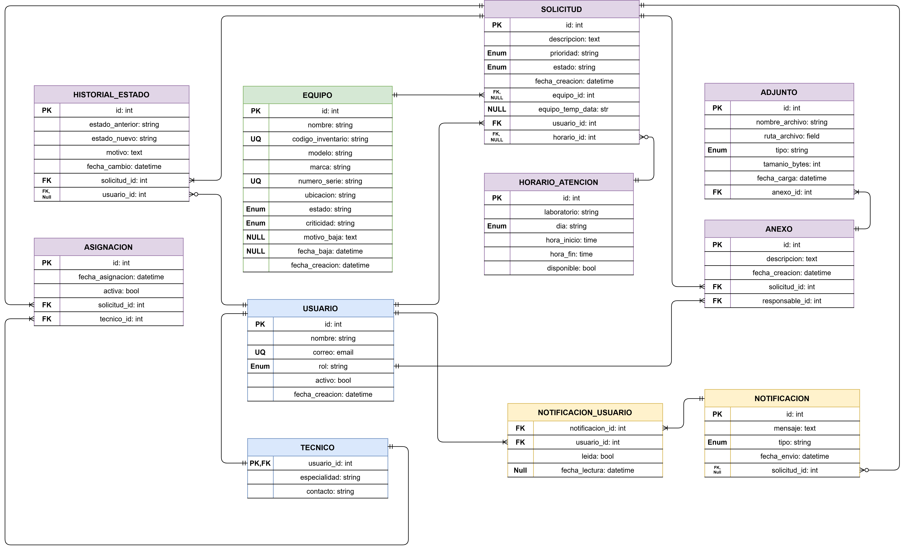

# Construcción y Exportación de la Base de Datos

Este documento describe la exportación  del modelo relacional del sistema utilizando Django ORM hacia PostgreSQL mediante migraciones automáticas.

---

# Objetivo

Definir la estructura lógica de la base de datos del sistema SysLab utilizando modelos Django, permitiendo:

- Representar entidades y relaciones mediante ORM.
- Centralizar la estructura del sistema en código Python.
- Generar automáticamente tablas PostgreSQL.
- Mantener control de versiones de la base de datos mediante migraciones.

---

# Archivos Relacionados

```text
project-backend/
│
├── src/
│   └── information_app/
│       ├── models.py
│       └── migrations/
│
└── scripts/
    └── backend/
        └── ExportarTablas.ps1
```

---

# Definición del Modelo Relacional

La estructura de la base de datos del sistema se encuentra definida dentro del archivo:

```text
src/information_app/models.py
```

En este archivo se almacenan todas las entidades, relaciones y configuraciones ORM utilizadas por Django para representar la estructura lógica del sistema dentro de PostgreSQL, tal y como se especifica en el siguiente diagrama de Entidad-Relación.




# Migraciones Django

Una vez definidos los modelos, Django permite transformar automáticamente las entidades ORM en tablas PostgreSQL mediante migraciones.

El proceso fue automatizado utilizando el script:

```text
scripts/backend/ExportarTablas.ps1
```

---

# Objetivo del Script

El script automatiza:

1. Activación del entorno virtual.
2. Verificación del proyecto Django.
3. Generación de migraciones ORM.
4. Aplicación automática en PostgreSQL.

---

# Ejecución del Script

Desde la raíz del proyecto:

```powershell
.\scripts\backend\ExportarTablas.ps1
```

---

# Siguiente Paso

Continuar con: [docs/django-structure.md](./django-structure.md)
