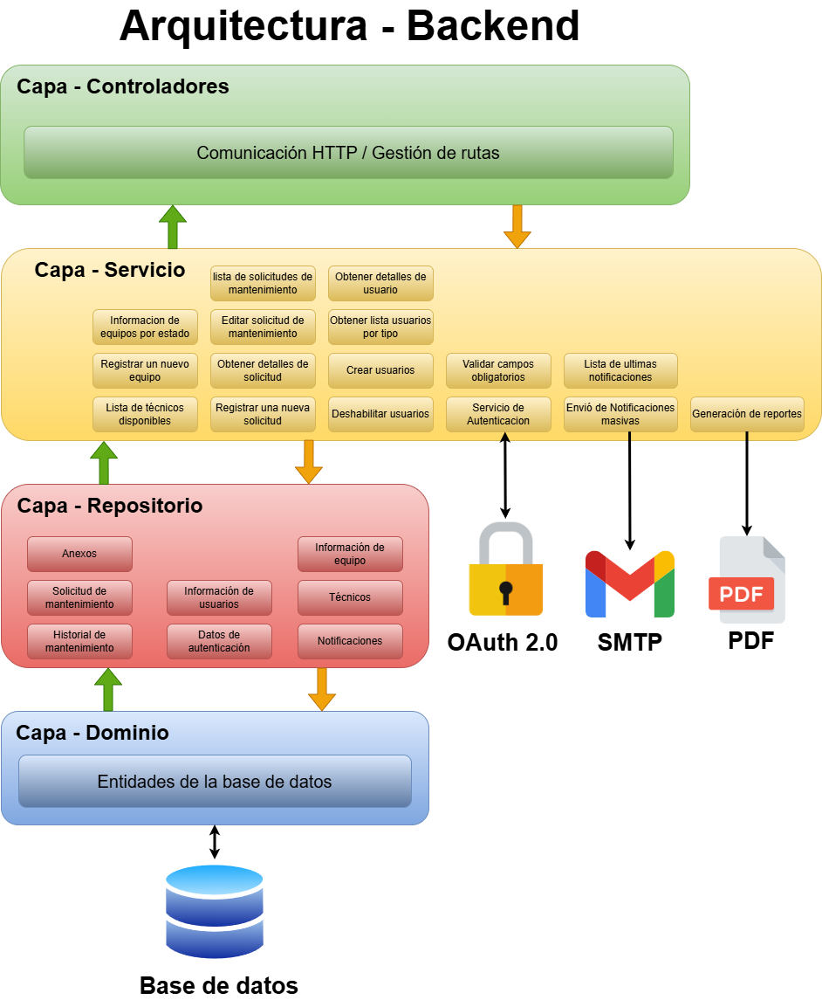

# Configuración e Inicialización del Backend

Este documento describe el proceso completo para configurar e inicializar el backend del proyecto SysLab, incluyendo PostgreSQL con Docker, el entorno Python, el proyecto Django y la exportación del modelo relacional a la base de datos.

---

# Objetivo

Automatizar completamente la inicialización del backend mediante un único script de configuración que cubre:

- Despliegue de PostgreSQL mediante Docker.
- Creación y configuración del usuario de base de datos para Django.
- Creación del entorno virtual de Python e instalación de dependencias.
- Generación del proyecto Django y la aplicación principal.
- Inicialización de la arquitectura monolítica por capas.
- Exportación del modelo relacional a PostgreSQL mediante migraciones.

---

# Requisitos Previos

| Software | Descripción |
|---|---|
| Docker Desktop | Motor de contenedores |
| Python 3.14+ | Entorno de ejecución del backend |
| Git | Control de versiones |

## Verificar instalaciones

```cmd
docker --version
docker compose version
python --version
```

---

# Estructura del Proyecto

```text
project-backend/
│
├── docker-compose.yml
├── requirements.txt
├── setup.bat               (Windows)
├── setup.sh                (Linux)
│
├── config/                 
│   └── settings.py
│
└── information_app/
    ├── controllers/
    ├── repositories/
    ├── services/
    ├── migrations/
    ├── models.py
    └── urls.py
```

---

# Credenciales Configuradas

| Parámetro | Valor |
|---|---|
| Base de datos | syslab_db |
| Usuario administrador | admin |
| Password administrador | 123456 |
| Usuario Django | django_user |
| Password Django | 12345 |
| Puerto PostgreSQL | 5434 |

---

# Script de Inicialización

Los scripts `setup.bat` (Windows) y `setup.sh` (Linux) unifican en un único flujo de ejecución las siguientes etapas: configuración de Docker, entorno virtual, proyecto Django y migraciones.

Ambos scripts son idempotentes: pueden ejecutarse múltiples veces sin generar duplicados, ya que verifican el estado actual antes de cada operación.

## Ejecución en Windows

```cmd
setup.bat
```

## Ejecución en Linux

```bash
chmod +x setup.sh
./setup.sh
```

---

# Flujo de Inicialización

## Etapa 1 — Docker y PostgreSQL

El script verifica el estado del contenedor `postgres_db` antes de realizar cualquier operación:

| Estado del contenedor | Acción |
|---|---|
| Corriendo | Se omite todo el bloque Docker |
| Detenido | Se reinicia con `docker start` |
| No existe | Se crea con `docker compose up` y se configura la base de datos |

Cuando el contenedor se crea por primera vez, el script espera 5 segundos para garantizar la inicialización correcta de PostgreSQL antes de ejecutar los comandos de configuración.

La configuración inicial de la base de datos incluye:

```sql
CREATE USER django_user WITH PASSWORD '12345';
GRANT ALL PRIVILEGES ON DATABASE syslab_db TO django_user;
GRANT ALL ON SCHEMA public TO django_user;
```

---
## Etapa 2 — Entorno Virtual de Python

El script verifica si el entorno virtual `venv-SysLab` existe:

| Estado | Acción |
|---|---|
| No existe | Se crea con `python -m venv` |
| Ya existe | Se activa directamente |

En ambos casos se ejecuta `pip install -r requirements.txt` para mantener las dependencias actualizadas ante cualquier cambio en el archivo.

### Dependencias instaladas

| Dependencia | Objetivo |
|---|---|
| Django | Framework principal del backend |
| psycopg | Conexión con PostgreSQL |
| Django REST Framework | Construcción de APIs REST |
| django-cors-headers | Configuración de políticas CORS |
| django-environ | Lectura de variables de entorno desde `.env` |

---

## Etapa 3 — Proyecto Django

Si `manage.py` no existe en la raíz, el script inicializa el proyecto Django:

```cmd
django-admin startproject config .
python manage.py startapp information_app
```

Luego reemplaza la carpeta generada por Django con la arquitectura por capas del proyecto:

```text
information_app/
├── controllers/
├── repositories/
├── services/
├── migrations/
├── models.py
└── urls.py
```

Si `manage.py` ya existe, esta etapa se omite completamente.

---

## Etapa 4 — Migraciones

Esta etapa se ejecuta siempre, independientemente de las etapas anteriores. Permite aplicar cambios al modelo relacional sin necesidad de reinicializar el proyecto completo.

```cmd
python manage.py makemigrations information_app
python manage.py migrate
```

---

# Configuración de Django

## Conexión con PostgreSQL

```python
DATABASES = {
    'default': {
        'ENGINE': 'django.db.backends.postgresql',
        'NAME': 'syslab_db',
        'USER': 'django_user',
        'PASSWORD': '12345',
        'HOST': 'localhost',
        'PORT': '5434',
    }
}
```

## Aplicaciones habilitadas

```python
INSTALLED_APPS = [
    'rest_framework',
    'corsheaders',
    'information_app',
]
```

## CORS

```python
CORS_ALLOWED_ORIGINS = [
    "http://localhost:5173",
]
```

## Middleware

Django utiliza una capa de middleware para procesar peticiones y respuestas antes de que lleguen a las vistas. La configuración incluye componentes estándar y uno personalizado para la gestión de tokens:

```python
MIDDLEWARE = [
    'corsheaders.middleware.CorsMiddleware',
    'django.middleware.security.SecurityMiddleware',
    'django.contrib.sessions.middleware.SessionMiddleware',
    'django.middleware.common.CommonMiddleware',
    
    # Middleware personalizado de renovación automática de tokens
    'information_app.middleware.AutoTokenRefreshMiddleware',
    
    'django.middleware.csrf.CsrfViewMiddleware',
    'django.contrib.auth.middleware.AuthenticationMiddleware',
    'django.contrib.messages.middleware.MessageMiddleware',
    'django.middleware.clickjacking.XFrameOptionsMiddleware',
]
```

| Middleware | Descripción |
|---|---|
| `AutoTokenRefreshMiddleware` | Middleware personalizado que intercepta peticiones y renueva automáticamente el access token si ha expirado, utilizando el refresh token proporcionado en el header `X-Refresh-Token` |
| `CORSMiddleware` | Maneja las cabeceras CORS para permitir la comunicación entre el backend y el frontend |
| `CsrfViewMiddleware` | Protección contra ataques de falsificación de solicitudes entre sitios |
| `AuthenticationMiddleware` | Asocia usuarios con sesiones usando cookies (requerido para Django Admin) |

---

## Autenticación (OAuth 2.0 y JWT)

Esta configuración es requerida para el módulo de login mediante Google OAuth. Las credenciales se leen desde un archivo `.env` en la raíz del proyecto usando `django-environ`.

### Archivo `.env`

Crear el archivo `.env` en la raíz del proyecto con las siguientes variables:

```env
GOOGLE_CLIENT_ID=your_google_client_id
GOOGLE_CLIENT_SECRET=your_google_client_secret
GOOGLE_REDIRECT_URI=http://localhost:8000/api/auth/callback/google/
```

> Las credenciales de Google se obtienen desde [Google Cloud Console](https://console.cloud.google.com/) creando un proyecto y configurando las credenciales OAuth 2.0.

### Configuración en `settings.py`

```python
import environ
env = environ.Env()
environ.Env.read_env()

# ── Google OAuth ───────────────────────────────────────────────────────────────
GOOGLE_CLIENT_ID     = env('GOOGLE_CLIENT_ID')
GOOGLE_CLIENT_SECRET = env('GOOGLE_CLIENT_SECRET')
GOOGLE_REDIRECT_URI  = env('GOOGLE_REDIRECT_URI')

# ── DRF: sin autenticación global (JWT manual en cada endpoint) ───────────────
REST_FRAMEWORK = {
    'DEFAULT_AUTHENTICATION_CLASSES': [],
    'DEFAULT_PERMISSION_CLASSES':     [],
}

# ── Cache para el state OAuth (anti-CSRF) — Redis en producción ───────────────
CACHES = {
    'default': {
        'BACKEND': 'django.core.cache.backends.locmem.LocMemCache',
    }
}
```

### Notas

| Configuración | Descripción |
|---|---|
| `GOOGLE_CLIENT_ID / SECRET` | Credenciales de la aplicación OAuth registrada en Google Cloud |
| `GOOGLE_REDIRECT_URI` | Debe coincidir exactamente con la URI configurada en Google Cloud Console |
| `DEFAULT_AUTHENTICATION_CLASSES: []` | Desactiva la autenticación global de DRF; cada endpoint gestiona su propio JWT |
| `DEFAULT_PERMISSION_CLASSES: []` | Desactiva los permisos globales de DRF; el control se aplica manualmente por vista |
| `LocMemCache` | Cache en memoria local, válido para desarrollo. **En producción reemplazar por Redis** |

---

# Arquitectura del Backend

El backend utiliza una arquitectura monolítica organizada por capas para separar responsabilidades y facilitar el mantenimiento.

| Componente | Responsabilidad |
|---|---|
| controllers | Manejo de endpoints HTTP y respuestas REST |
| services | Implementación de la lógica de negocio |
| repositories | Acceso y manipulación de datos en PostgreSQL |
| models.py | Definición de entidades y tablas ORM |
| migrations | Control de versiones de la base de datos |
| urls.py | Registro y organización de rutas |



---

# Modelo Relacional

La estructura de la base de datos está definida en:

```text
information_app/models.py
```

Las entidades, relaciones y configuraciones ORM definidas en este archivo son transformadas automáticamente en tablas PostgreSQL durante la Etapa 4 del script.


---

# Siguiente Paso

Continuar con: [docs/backend_execute.md](./backend_execute.md)